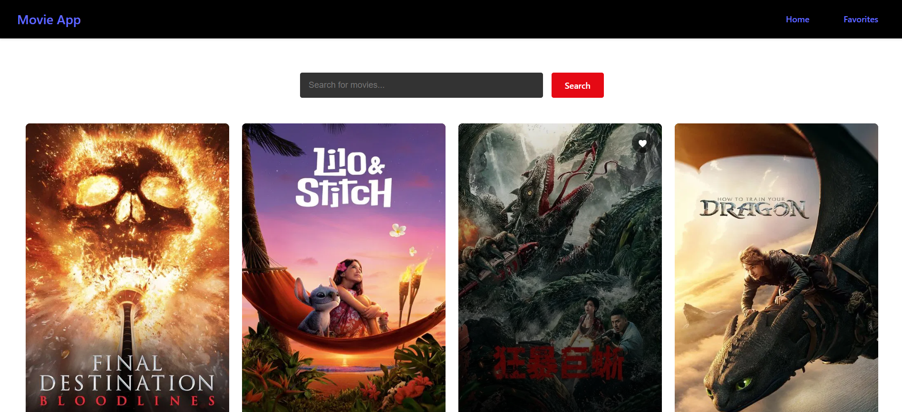

# 🎬 React Movie App

A dynamic and responsive Movie App built using **ReactJS**, **Vite**, and **CSS**.  
It fetches movie data from an external API and allows users to:

- 🔍 Search for movies by title  
- ❤️ Add or remove movies from a favorites list  
- 📱 Enjoy a clean and responsive UI for all devices

---

## 🛠️ Technologies Used

- **ReactJS**  
- **Vite**  
- **CSS (modular styling)**  
- **TMDb API (or similar)**  
- **React Context API** for global state management

---

## 🚀 How to Run Locally

1. Clone the repository  
2. Install dependencies  
3. Start the development server

```bash
git clone https://github.com/your-username/react-movie-app.git
cd react-movie-app
npm install
npm run dev
```

## 📸 Screenshot

